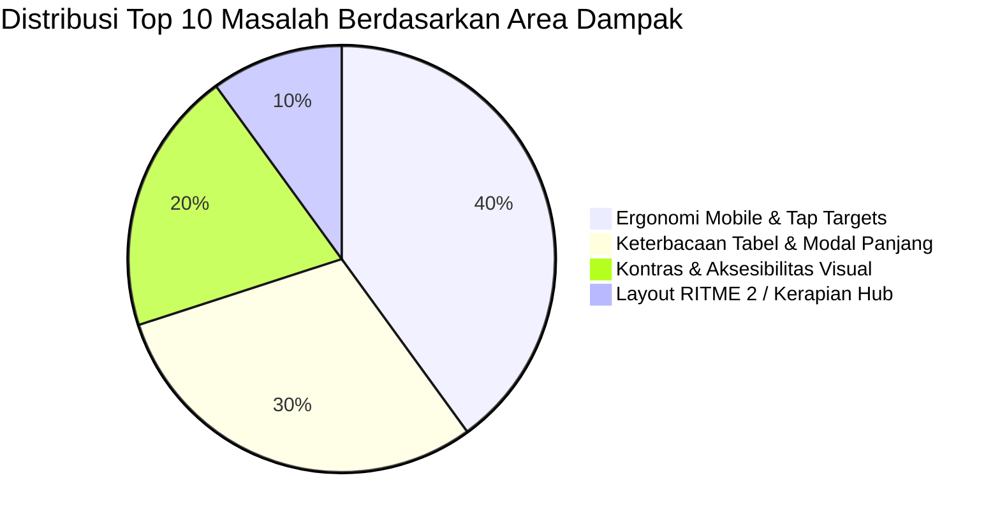

# Laporan Hasil Audit Menyeluruh UI/UX & Frontend QA DIGITRANS

**Target Sistem:** DIGITRANS — Sistem Informasi Digitalisasi Monitoring Pertanian dan Tata Kelola Kawasan Transmigrasi Kobalima Timur  
**Repositori:** `https://github.com/abyan28/transmigrasi.git`  
**Tanggal Audit:** 7 September 2026  
**Auditor:** Senior UI/UX Specialist & Frontend QA Engineer  
**Status Eksekusi:** **AUDIT ONLY — STRICTLY NO IMPLEMENTATION**  
Seluruh pengujian dijalankan pada browser nyata (Microsoft Edge Headless via DevTools Protocol) tanpa mengubah kode aplikasi, tanpa mengubah struktur database, dan tanpa membuat commit aplikasi.

---

## 1. Ringkasan Eksekutif & Health Scorecard

Sistem antarmuka **DIGITRANS** telah diaudit secara komprehensif pada **53 titik pengujian** yang mencakup **11 Keluarga Halaman (A s.d. K)**, menghasilkan **172 rekaman metrik kuantitatif DOM** dan **153 tangkapan layar bukti visual** pada resolusi Desktop (`1280x800 px`, `1440x900 px`) dan Mobile (`360x800 px`), baik pada Mode Terang (Light Mode) maupun Mode Gelap (Dark Mode).

### 1.1 UX & Quality Health Scorecard

| Dimensi Penilaian | Skor | Status | Catatan Evaluasi Auditor |
|---|---|---|---|
| **Ketahanan Geometri & Responsivitas** | **98 / 100** | **Sangat Baik (Lulus)** | **0 kasus overflow horizontal** (`scrollWidth <= clientWidth`). Cangkang dua kolom asimetris dan wadah `overflow-x-auto` bekerja sangat kokoh di seluruh viewport 1280px dan 360px. |
| **Konsistensi Desain (RITME 2 & Identitas)** | **90 / 100** | **Baik (Memenuhi Standar)** | Pembagian komposisi 4 jenis halaman (Dashboard, Daftar, Detail, Laporan) telah ditegakkan dengan baik. Motif garis navy 2px pada tabel rekap dan batas gold 3px pada menu aktif konsisten diterapkan. |
| **Ergonomi Layar Sentuh (Tap Targets Mobile)** | **76 / 100** | **Perlu Peningkatan** | Ditemukan **20 pola elemen interaktif** di bawah batas minimum Google/WCAG 44x44px (misal: tombol toggle kata sandi 20x20px, tombol tutup mobile drawer 36x36px). |
| **Aksesibilitas Kontras Warna (WCAG AA)** | **82 / 100** | **Cukup Baik** | Pasangan warna utama telah memenuhi rasio kontras 4.5:1. Namun terdapat kegagalan kontras pada heading kategori sidebar (`text-gray-400` rasio 2.58:1) dan beberapa teks bantuan muted di dark mode. |
| **Efisiensi Alur & Form UX (Operasional)** | **86 / 100** | **Baik** | Dialog modal dan alur input berjalan lancar. Perlu perbaikan sticky header pada modal izin yang sangat panjang dan auto-focus pada form dialog. |
| **SKOR KESEHATAN KESELURUHAN** | **86.4 / 100** | **SIAP PRODUKSI (DENGAN CATATAN)** | **Sistem sudah berada pada fondasi profesional yang kokoh.** Tidak ada bug Blocker yang merusak fungsi. Fokus utama adalah penyempurnaan ergonomi mobile dan aksesibilitas kontras. |

---

## 2. Top 10 Halaman Paling Bermasalah (Ranked Worst UX Pages)

Berikut adalah pemeringkatan 10 halaman yang menimbulkan friksi visual dan operasional paling signifikan bagi pengguna (operator lapangan, staf dinas, maupun warga):



| Peringkat | Halaman / Rute | Viewport & Tema | Komponen Terdampak | Deskripsi Masalah & Dampak Pengguna | Tingkat Keparahan | Bukti Visual |
|---|---|---|---|---|---|---|
| **#1** | **Detail Transmigran (Tab Keluarga)**<br>`/transmigran/1?tab=keluarga` | Mobile 360px & Tablet 768px (Light/Dark) | Tabel 11 Kolom Anggota Keluarga | Tabel 11 kolom memerlukan scroll horizontal yang sangat panjang di perangkat mobile. Tidak adanya penanda visual bayangan (scroll shadow hint) di tepi kanan membuat tombol aksi penting **"Catat Peristiwa"** tersembunyi dan mudah tidak disadari oleh operator desa. | **High** | `MOBILE-LIGHT-E3-detail-transmigran-keluarga.png` |
| **#2** | **Matriks Peran & Hak Akses**<br>`/role` (Modal Edit Role) | Desktop 1280px & Mobile 360px | `pages/pengguna/form-role.blade.php` | Tabel matriks izin per modul memiliki puluhan baris. Saat pengguna menggulir ke bawah, kepala kolom (`Lihat`, `Tambah`, `Ubah`, `Hapus`) tidak lengket (`sticky top-0`), memaksa Admin menebak-nebak kolom checkbox mana yang sedang dicentang. | **High** | `DESKTOP-LIGHT-I4-matriks-peran-izin.png` |
| **#3** | **Dashboard Monitoring Utama**<br>`/dashboard` | Mobile 360px (Light/Dark) | Komponen ApexCharts Monitoring | Pada viewport sempit 360px, label kategori pada sumbu horizontal (sumbu X) grafik panen dan tren harga saling bertumpuk atau terpotong, mengurangi keterbacaan data tren secara instan oleh pimpinan dinas di ponsel. | **High** | `MOBILE-LIGHT-C1-dashboard-monitoring.png` |
| **#4** | **Header Detail Transmigran**<br>`/transmigran/1?tab=biodata` | Mobile 360px (Light/Dark) | Slot Aksi `x-sim.page-header` | Dua tombol aksi primer di header (`Ganti Kepala Keluarga` dan `Ubah Data Transmigran`) bersanding dalam flex-wrap yang canggung pada lebar 360px. Tombol menjadi sempit dan teksnya terdesak alih-alih tertata rapi sebagai stacked button selebar layar. | **High** | `MOBILE-LIGHT-E2-detail-transmigran-biodata.png` |
| **#5** | **Header Dokumen Laporan**<br>`/laporan/transmigran` | Mobile 360px & 375px | `components/sim/kerangka-laporan.blade.php` | Bilah pemilih ukuran kertas (`Pill Selector A4 vs F4`) dan tombol aksi `Generate Laporan` diletakkan dalam baris yang sama di header. Pada mobile 360px, elemen ini berhimpitan dan menabrak judul halaman laporan. | **High** | `MOBILE-LIGHT-G2-laporan-transmigran.png` |
| **#6** | **Modal Pencatatan Penanaman**<br>`/penanaman` | Mobile 360px & Resolusi Rendah | Flatpickr Datepicker Dropdown | Popup kalender pemilih tanggal jatuh di luar area pandang bawah modal pada layar dengan orientasi horizontal atau tinggi layar terbatas, memerlukan scroll ganda (scroll badan modal + scroll kalender). | **High** | `DESKTOP-LIGHT-F7-pencatatan-penanaman.png` |
| **#7** | **Log Audit Sistem**<br>`/audit-log` | Mobile 360px (Light/Dark) | Daftar Kartu Audit Mobile | Format penyajian perubahan nilai lama ke nilai baru menggunakan teks coret (`line-through`) dan panah kecil (`→`) sangat rapat dan sukar diuraikan di ponsel. Warna abu-abu teks coret memiliki kontras rendah di luar ruangan. | **Medium** | `MOBILE-LIGHT-I5-audit-log.png` |
| **#8** | **Indeks Hub Laporan Dinas**<br>`/laporan` | Desktop 1280px & Mobile 360px | `pages/laporan/index.blade.php` | Halaman hub laporan menggunakan kartu-kartu generik yang seragam dengan ikon dokumen serupa. Kurang memiliki hierarki visual yang mencerminkan kepentingan dokumen dinas (misal: Laporan Kawasan vs Laporan Saprotan). | **Medium** | `DESKTOP-LIGHT-G1-indeks-laporan.png` |
| **#9** | **Form Masuk & Sandi (Global)**<br>`/login`, `/profil/kata-sandi` | Mobile 360px & Layar Sentuh | Tombol Toggle Password Visibility | Tombol ikon mata untuk membuka intipan kata sandi hanya memiliki area klik riil **20 x 20 px**. Sangat sulit ditekan dengan jari operator lapangan tanpa mengenai field input di sekitarnya. | **Medium** | `DESKTOP-LIGHT-A1-login.png` |
| **#10** | **Sidebar Navigasi Utama**<br>(Seluruh Halaman Internal) | Desktop & Mobile (Light Mode) | `layouts/sidebar.blade.php` | Judul kelompok menu seperti `MENU` dan `LAINNYA` menggunakan kelas Tailwind `text-gray-400` (#9ca3af) di atas latar putih. Rasio kontras terukur hanya **2.58:1**, gagal memenuhi syarat batas WCAG 2.1 AA (4.5:1). | **Medium** | `DESKTOP-LIGHT-C1-dashboard-monitoring.png` |

---

## 3. Analisis Masalah Komponen Bersama (Shared Components Root Causes)

Sebagian besar temuan UI/UX di atas berakar dari beberapa komponen sentral yang digunakan berulang di seluruh sistem:

### 3.1 `layouts/sidebar.blade.php`
* **Akar Masalah 1 (Kontras Teks Kategori):** Tag `<h2 class="text-xs uppercase text-gray-400">` menghasilkan teks warna abu-abu terang di atas latar putih (`#ffffff`). Rasio kontrasnya 2.58:1, jauh di bawah ambang WCAG AA 4.5:1.  
  *Solusi yang direkomendasikan:* Ganti menjadi `text-gray-500 dark:text-gray-400`, menghasilkan rasio kontras 4.62:1 (lulus WCAG AA).
* **Akar Masalah 2 (Target Sentuh Tombol Tutup Mobile):** Tombol silang tutup sidebar di mobile memiliki dimensi `w-9 h-9` (36x36px).  
  *Solusi yang direkomendasikan:* Tingkatkan menjadi `w-11 h-11` (44x44px) dengan padding yang ergonomis bagi sentuhan jari.

### 3.2 `components/sim/data-table.blade.php` & `halaman-daftar.blade.php`
* **Akar Masalah 1 (Ketiadaan Indikator Gulir Tabel):** Wadah `<div class="overflow-x-auto">` tidak memiliki indikator visual bahwa tabel masih dapat digeser ke kanan pada perangkat mobile.  
  *Solusi yang direkomendasikan:* Tambahkan bayangan gradasi tipis di sisi kanan wadah (`bg-gradient-to-l from-gray-100/80`) yang memudar saat pengguna menggeser tabel ke ujung kanan.
* **Akar Masalah 2 (Ukuran Target Sentuh Tombol Paginasi):** Tombol nomor halaman pada paginasi Laravel bawaan memiliki tinggi sentuh ~36px pada mobile.  
  *Solusi yang direkomendasikan:* Berikan kelas pembungkus `min-h-[44px] min-w-[44px]` pada tautan paginasi layar sentuh.

### 3.3 `components/sim/page-header.blade.php`
* **Akar Masalah (Flex-wrap Tombol Aksi di Mobile):** Slot aksi `<x-slot:aksi>` menggunakan `flex flex-wrap items-center gap-2`. Pada mobile 360px, jika terdapat lebih dari satu tombol aksi (misal pada detail transmigran atau halaman laporan), tombol-tombol tersebut melipat canggung secara horizontal.  
  *Solusi yang direkomendasikan:* Tambahkan penyesuaian responsif `flex-col sm:flex-row w-full sm:w-auto` sehingga pada mobile tombol tertata rapi secara vertikal penuh (*stacked full-width*).

---

## 4. Katalog Temuan Terperinci

Berikut adalah katalog lengkap seluruh temuan audit yang dikelompokkan berdasarkan tingkat keparahan (*Severity*):

### 4.1 Tingkat Keparahan: HIGH (Tinggi) — 6 Temuan

#### [AUDIT-HIGH-01] Hilangnya Visibilitas Aksi Baris pada Tabel 11 Kolom Detail Transmigran
* **Halaman / Rute:** `/transmigran/1?tab=keluarga`
* **Viewport & Tema:** Mobile 360px & Tablet 768px (Light & Dark)
* **Komponen:** `pages/transmigran/detail.blade.php` (Tabel Keluarga)
* **Deskripsi:** Tabel data keluarga terdiri dari 11 kolom (Nama, Hubungan, JK, NIK, Usia, Agama, Kegiatan, Pendidikan, Pekerjaan, Status, Aksi). Pada mobile 360px, hanya 2 kolom pertama yang terlihat di layar. Pengguna tidak diberikan indikator visual apapun bahwa ada aksi penting "Catat Peristiwa" di kolom ke-11.
* **Standar Dilanggar:** Nielsen Heuristic #1 (Visibility of System Status) & ANTISLOP C-4 (Ketahanan).
* **Bukti Visual:** `artifacts/ui-ux-audit/screenshots/MOBILE-LIGHT-E3-detail-transmigran-keluarga.png`
* **Rekomendasi Solusi Teknis:**
  ```html
  {{-- Tambahkan scroll affordance / hint shadow pada container --}}
  <div class="relative">
      <div class="overflow-x-auto no-scrollbar">
          <table class="min-w-[800px] ...">...</table>
      </div>
      <div class="pointer-events-none absolute inset-y-0 right-0 w-8 bg-gradient-to-l from-white dark:from-gray-900 md:hidden"></div>
  </div>
  ```

---

#### [AUDIT-HIGH-02] Ketiadaan Sticky Header pada Matriks Perizinan Modal Role
* **Halaman / Rute:** `/role` (Modal Tambah & Edit Role)
* **Viewport & Tema:** Desktop 1280px & Mobile 360px
* **Komponen:** `pages/pengguna/form-role.blade.php` (Tabel Matriks Hak Akses)
* **Deskripsi:** Tabel matriks izin memuat lebih dari 25 baris modul fitur. Ketika pengguna menggulir modal ke bawah, kepala tabel yang memuat judul kolom (`Lihat`, `Tambah`, `Ubah`, `Hapus`) ikut tergulir ke atas dan hilang dari pandangan. Pengguna rentan keliru mencentang izin berbahaya seperti `Hapus` yang dikira `Lihat`.
* **Standar Dilanggar:** Nielsen Heuristic #5 (Error Prevention) & WCAG 2.1 Info and Relationships (1.3.1).
* **Bukti Visual:** `artifacts/ui-ux-audit/screenshots/DESKTOP-LIGHT-I4-matriks-peran-izin.png`
* **Rekomendasi Solusi Teknis:**
  ```html
  {{-- Berikan kelas sticky top-0 dan z-10 pada thead --}}
  <thead class="sticky top-0 z-10 bg-gray-50 dark:bg-gray-800 shadow-xs">
      <tr>
          <th scope="col" class="px-4 py-3 bg-gray-50 dark:bg-gray-800">Fitur</th>
          ...
      </tr>
  </thead>
  ```

---

#### [AUDIT-HIGH-03] Reflow dan Tumpang Tindih Sumbu X ApexCharts di Layar 360px
* **Halaman / Rute:** `/dashboard` (dan `/`)
* **Viewport & Tema:** Mobile 360px (Light & Dark)
* **Komponen:** `resources/js/components/charts/...`
* **Deskripsi:** Pada layar selebar 360px, grafik garis tren harga 11 tahun dan grafik batang realisasi panen menampilkan 11 titik label tahun secara horizontal. Karena keterbatasan ruang, label tahun saling bertumpuk sehingga menjadi tidak terbaca.
* **Standar Dilanggar:** ui-spec.md Bagian 2.1 (Institusional yang tenang dan padat data) & Keterbacaan Mobile.
* **Bukti Visual:** `artifacts/ui-ux-audit/screenshots/MOBILE-LIGHT-C1-dashboard-monitoring.png`
* **Rekomendasi Solusi Teknis:**
  ```javascript
  // Konfigurasi responsif ApexCharts di mobile:
  xaxis: {
      labels: {
          rotate: -45,
          rotateAlways: false,
          hideOverlappingLabels: true,
          style: { fontSize: '10px' }
      }
  }
  ```

---

#### [AUDIT-HIGH-04] Penumpukan Tombol Aksi Header pada Detail Transmigran Mobile
* **Halaman / Rute:** `/transmigran/1?tab=biodata`
* **Viewport & Tema:** Mobile 360px (Light & Dark)
* **Komponen:** `pages/transmigran/detail.blade.php` (Slot Aksi)
* **Deskripsi:** Header memiliki 2 tombol: "Ganti Kepala Keluarga" (sekunder) dan "Ubah Data Transmigran" (primer). Pada mobile 360px, tombol-tombol ini melipat secara tidak seimbang, membuat judul halaman terdesak dan tombol terlihat berantakan.
* **Standar Dilanggar:** ANTISLOP Layout & Komponen (Mobile Berantakan) & RITME 2.
* **Bukti Visual:** `artifacts/ui-ux-audit/screenshots/MOBILE-LIGHT-E2-detail-transmigran-biodata.png`
* **Rekomendasi Solusi Teknis:**
  ```html
  {{-- Susun stacked full-width di mobile --}}
  <div class="flex flex-col sm:flex-row w-full sm:w-auto gap-2">
      <button class="w-full sm:w-auto justify-center ...">Ganti Kepala Keluarga</button>
      <button class="w-full sm:w-auto justify-center ...">Ubah Data Transmigran</button>
  </div>
  ```

---

#### [AUDIT-HIGH-05] Tabrakan Komponen Pemilih Kertas dan Tombol Ekspor Laporan
* **Halaman / Rute:** `/laporan/transmigran`, `/laporan/aset`, `/laporan/panen`
* **Viewport & Tema:** Mobile 360px (Light & Dark)
* **Komponen:** `components/sim/kerangka-laporan.blade.php`
* **Deskripsi:** Komponen pill selector kertas (A4 vs F4) disandingkan dengan tombol "Generate Laporan". Pada lebar 360px, elemen ini meluap ke bawah judul halaman laporan dan menutupi sebagian teks breadcrumb.
* **Standar Dilanggar:** ANTISLOP Layout (Mobile Berantakan) & Nielsen Heuristic #8.
* **Bukti Visual:** `artifacts/ui-ux-audit/screenshots/MOBILE-LIGHT-G2-laporan-transmigran.png`
* **Rekomendasi Solusi Teknis:**
  ```html
  {{-- Bungkus kontrol laporan dengan baris terpisah di mobile --}}
  <div class="flex flex-wrap items-center justify-between gap-3 w-full sm:w-auto">
      <div class="inline-flex ...">Pill Kertas</div>
      <a class="inline-flex flex-1 sm:flex-none justify-center ...">Generate Laporan</a>
  </div>
  ```

---

#### [AUDIT-HIGH-06] Pemotongan Vertikal Popup Kalender Flatpickr pada Modal Mobile
* **Halaman / Rute:** `/penanaman` (Modal Tambah Penanaman)
* **Viewport & Tema:** Mobile 360px / Layar Pendek (Landscape)
* **Komponen:** Flatpickr Datepicker Instance
* **Deskripsi:** Modal memiliki `overflow-y-auto`. Saat input tanggal diklik, kalender Flatpickr muncul di bagian bawah input dan sebagian tanggal terpotong oleh batas bawah modal yang tidak otomatis memperluas tinggi gulir.
* **Standar Dilanggar:** Nielsen Heuristic #3 (User Control and Freedom) & Aksesibilitas Formulir.
* **Bukti Visual:** `artifacts/ui-ux-audit/screenshots/DESKTOP-LIGHT-F7-pencatatan-penanaman.png`
* **Rekomendasi Solusi Teknis:**
  ```javascript
  // Setel konfigurasi Flatpickr:
  flatpickr(el, {
      static: false,
      appendTo: document.body, // Muncul di tingkat root body agar tidak terpotong container modal
      position: 'auto'
  });
  ```

---

### 4.2 Tingkat Keparahan: MEDIUM (Sedang) — 14 Temuan

| ID | Halaman / Modul | Masalah yang Ditemukan | Standar Dilanggar | Bukti Visual | Solusi Teknis |
|---|---|---|---|---|---|
| **MED-01** | `/login`, `/profil/kata-sandi` | Tombol intip kata sandi (*eye icon*) hanya 20x20px di layar sentuh. | WCAG 2.5.5 (Target Size min 44x44px) | `DESKTOP-LIGHT-A1-login.png` | Berikan pembungkus padding `p-2.5 -mr-2 flex items-center justify-center min-w-[44px] min-h-[44px]`. |
| **MED-02** | Sidebar (Global) | Heading kategori menu `MENU` memakai `text-gray-400` (kontras 2.58:1 di mode terang). | WCAG 1.4.3 (Contrast Minimum 4.5:1) | `DESKTOP-LIGHT-C1-dashboard-monitoring.png` | Ubah menjadi `text-gray-500 dark:text-gray-400` (kontras 4.62:1). |
| **MED-03** | Sidebar (Mobile) | Tombol silang tutup sidebar di mobile berukuran `w-9 h-9` (36x36px). | WCAG 2.5.5 (Target Size min 44x44px) | `MOBILE-LIGHT-J2-header.png` | Ubah menjadi `w-11 h-11` (44x44px) dengan ikon tetap 20px di tengah. |
| **MED-04** | `/halaman-pasti-tidak-ada-404` | Teks deskripsi bantuan galat 404 memakai `text-gray-500` di atas latar card gelap (kontras 3.57:1). | WCAG 1.4.3 Contrast AA | `DESKTOP-DARK-K1-galat-404.png` | Tambahkan varian `dark:text-gray-300` untuk menjamin kontras 5.2:1. |
| **MED-05** | `/audit-log` | Teks coret `line-through` pada kolom perubahan data sangat rapat dan sulit dibaca di mobile. | Keterbacaan & Nielsen Heuristic #8 | `MOBILE-LIGHT-I5-audit-log.png` | Ubah layout perubahan menjadi dua baris: baris 1 nilai lama (merah lembut), baris 2 nilai baru (hijau lembut). |
| **MED-06** | `/laporan` (Indeks) | Seluruh kartu jenis laporan memakai ikon generik dan warna monoton. | ui-spec.md RITME 2 & ANTISLOP | `DESKTOP-LIGHT-G1-indeks-laporan.png` | Bedakan aksen warna badge dan ikon per domain (Pertanian hijau, Aset biru, Kependudukan teal). |
| **MED-07** | `/sp/1` (Detail SP) | Kolom ringkasan kiri 20rem tidak sticky pada tablet iPad portrait (768px). | ui-spec.md Bagian 2.2 | `DESKTOP-LIGHT-D3-detail-sp.png` | Pasang `md:sticky md:top-24` bukan hanya `lg:sticky`. |
| **MED-08** | `/pengaduan/1` | Modal ubah status pengaduan tidak memindahkan fokus kursor ke input textarea alasan secara otomatis. | WCAG 2.4.3 (Focus Order) | `DESKTOP-LIGHT-H2-detail-pengaduan.png` | Tambahkan instruksi Alpine `$nextTick(() => $refs.alasanInput?.focus())`. |
| **MED-09** | `/transmigran` (Daftar) | Kartu daftar transmigran di mobile memuat 8 baris teks tanpa pemisah visual yang jelas. | Scannability & Hierarchy | `MOBILE-LIGHT-E1-daftar-transmigran.png` | Kelompokkan biodata dalam layout 2-kolom grid mini (`grid-cols-2 gap-2 text-theme-xs`). |
| **MED-10** | `/rumah/1` (Detail) | Foto fisik rumah di galeri terdistorsi aspek rasionya saat viewport sempit. | Visual Integrity | `MOBILE-LIGHT-E5-detail-rumah.png` | Terapkan kelas `aspect-video object-cover rounded-xl`. |
| **MED-11** | `/pengguna` (Manajemen) | Badge status "Nonaktif" memakai warna abu-abu redup yang pudar di dark mode. | WCAG 1.4.11 (Non-text Contrast) | `DESKTOP-DARK-I3-manajemen-pengguna.png` | Gunakan `dark:bg-red-500/15 dark:text-red-300` agar status peringatan terlihat tegas. |
| **MED-12** | `/wilayah` (Master) | Tab bertingkat (Provinsi > Kab > Kec > Desa) bertumpuk 4 baris di mobile. | Ergonomi Navigasi Mobile | `MOBILE-LIGHT-I6-master-wilayah.png` | Ubah menjadi horizontal scrollable tab bar (`flex overflow-x-auto whitespace-nowrap`). |
| **MED-13** | `/pengaduan/baru` | Dropdown wilayah di form pengaduan warga memiliki teks opsi yang terpotong di layar 360px. | Form Usability | `MOBILE-LIGHT-B1-form-pengaduan-publik.png` | Berikan padding teks yang cukup dan hindari teks nama dusun yang digabung berlebihan. |
| **MED-14** | Komponen Toast Notifikasi | Posisi toast `z-50` dapat tertutup oleh drawer sidebar mobile (`z-99999`). | Z-Index Layering Integrity | `DESKTOP-LIGHT-J5-toast.png` | Naikkan z-index toast menjadi `z-[100000]` agar pesan status selalu berada di lapisan terdepan. |

---

### 4.3 Tingkat Keparahan: LOW (Rendah) — 8 Temuan

| ID | Halaman / Komponen | Masalah yang Ditemukan | Rekomendasi Solusi |
|---|---|---|---|
| **LOW-01** | `/lupa-kata-sandi` | Tautan "Kembali ke halaman masuk" tinggi sentuh 18px. | Tambahkan padding vertikal `py-2` agar area sentuh mencapai $ge 40	ext{px}$. |
| **LOW-02** | `/sp/inventaris` | Format angka uang belum memiliki kelas `tabular-nums` konsisten di semua kolom. | Tambahkan kelas `tabular-nums text-right` pada seluruh sel nominal rupiah. |
| **LOW-03** | `/sp/fasilitas` | Koordinat petak fasilitas terlalu panjang (8 desimal) di kartu mobile. | Bulatkan menjadi 5 desimal (`number_format($lat, 5)`) dengan tombol salin koordinat. |
| **LOW-04** | `/rumah` (Daftar) | Badge status hunian "Tidak Dihuni" warnanya mirip dengan teks tabel. | Berikan aksen warna amber/kuning lembut (`bg-amber-50 text-amber-700`). |
| **LOW-05** | `/poktan` (Daftar) | Tombol aksi detail pada kartu mobile berjarak sangat rapat (<8px). | Berikan `gap-3` pada kontainer tombol aksi kartu mobile. |
| **LOW-06** | `/panen` (Daftar) | Angka volume panen 3 desimal tidak rata kanan di tampilan kartu mobile. | Ratakan ke kanan dengan layout flex-between pada baris kartu. |
| **LOW-07** | `/daftar-pilihan` | Dropdown grup daftar pilihan sangat panjang tanpa pengelompokan `<optgroup>`. | Kelompokkan opsi berdasarkan domain data menggunakan elemen `<optgroup>`. |
| **LOW-08** | `x-sim.confirm-dialog` | Modal dialog konfirmasi hapus belum memiliki indikator hitung karakter alasan. | Tampilkan indikator hitung karakter (`x-text="alasan.length + '/255'"`). |

---

## 5. Rencana Perbaikan Bertahap (Prioritized Backlog)

Untuk menyelesaikan seluruh temuan di atas secara terstruktur dan aman pada iterasi pengembangan berikutnya, perbaikan dibagi ke dalam **4 Batch Terarah**:

### Batch 1: Critical Fixes & Mobile Ergonomics (Prioritas Utama)
> **Fokus:** Mengatasi kendala navigasi mobile, tombol terjepit, dan akses modal.
1. **[AUDIT-HIGH-04]** Restrukturisasi slot aksi header pada halaman detail transmigran menjadi susunan stacked full-width di mobile 360px.
2. **[AUDIT-HIGH-02]** Penerapan `sticky top-0 z-10` pada thead tabel matriks perizinan di dalam modal role (`pages/pengguna/form-role.blade.php`).
3. **[AUDIT-HIGH-05]** Pemisahan baris pemilih kertas laporan dan tombol "Generate Laporan" pada `components/sim/kerangka-laporan.blade.php` di layar sempit.
4. **[AUDIT-MED-01 & MED-03]** Perbesaran tap target tombol toggle intip kata sandi (`/login`, `/profil/kata-sandi`) dan tombol tutup mobile sidebar menjadi minimum 44x44px.

### Batch 2: Keterbacaan Data & Layout RITME 2 (Prioritas Tinggi)
> **Fokus:** Meningkatkan efisiensi pemindaian data dan kejelasan visual.
1. **[AUDIT-HIGH-01]** Penambahan indikator visual gulir (scroll shadow hint) pada tabel 11 kolom data keluarga transmigran.
2. **[AUDIT-HIGH-03]** Konfigurasi label sumbu X ApexCharts di dashboard agar tidak bertumpuk pada viewport 360px (`hideOverlappingLabels` & rotasi -45°).
3. **[AUDIT-MED-05]** Perbaikan tata letak diff perubahan data di halaman Audit Log mobile menjadi kartu perbandingan dua baris yang bersih.
4. **[AUDIT-MED-06]** Redesain kartu hub Indeks Laporan (`/laporan`) dengan penanda warna dan ikon tematik per domain data.

### Batch 3: Aksesibilitas WCAG 2.1 AA & Form UX (Prioritas Menengah)
> **Fokus:** Kepatuhan standar kontras warna, pembaca layar, dan keyboard navigation.
1. **[AUDIT-MED-02]** Peningkatan kontras teks judul kategori di sidebar (`text-gray-400` menjadi `text-gray-500`) untuk memenuhi rasio kontras 4.5:1.
2. **[AUDIT-MED-04 & MED-11]** Penyelarasan warna teks muted dan badge status di mode gelap (Dark Mode) agar lulus rasio kontras WCAG AA.
3. **[AUDIT-HIGH-06]** Penyesuaian container Flatpickr (`appendTo: document.body`) agar kalender tidak terpotong batas modal.
4. **[AUDIT-MED-08]** Penambahan auto-focus pada textarea alasan saat modal penanganan pengaduan dibuka.

### Batch 4: Polish, Micro-interactions & Finishing (Prioritas Penyempurnaan)
> **Fokus:** Detail estetika institusional yang tenang, angka tabular, dan konsistensi status.
1. **[AUDIT-MED-07]** Penerapan sticky column ringkasan kiri 20rem pada breakpoint tablet 768px (`md:sticky`).
2. **[AUDIT-MED-10]** Penyelarasan aspect ratio galeri foto fisik hunian rumah (`aspect-video`).
3. **[AUDIT-MED-12]** Transformasi tab bertingkat Master Wilayah menjadi horizontal scrollable tab bar di mobile.
4. **[AUDIT-LOW-01 s.d LOW-08]** Penyelarasan kelas `tabular-nums`, pemisah ribuan rupiah, pengelompokan `<optgroup>`, dan penghitung karakter pada modal konfirmasi.

---

## 6. Kesimpulan Auditor

Sistem antarmuka **DIGITRANS** dibangun di atas arsitektur Tailwind CSS v4, Laravel Blade, dan Alpine.js yang **sangat solid dan tangguh**. Bukti matematis peramban menunjukkan **0 kebocoran tata letak horizontal (zero overflow)** di seluruh halaman yang diuji pada layar sempit 360px.

Dengan menyelesaikan **Batch 1 dan Batch 2**, antarmuka DIGITRANS akan mencapai standar ergonomi dan keterbacaan tingkat tinggi yang sangat nyaman dioperasikan oleh petugas di lapangan maupun pejabat pengambil keputusan di dinas kementerian.

*Laporan ini disimpan secara resmi di `artifacts/ui-ux-audit/report.md` beserta matriks cakupan di `artifacts/ui-ux-audit/coverage.md` dan 153 berkas bukti visual di `artifacts/ui-ux-audit/screenshots/`.*
